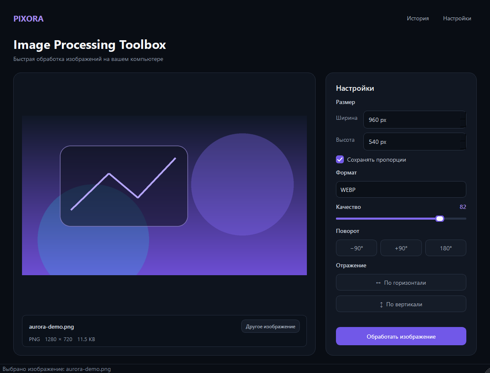
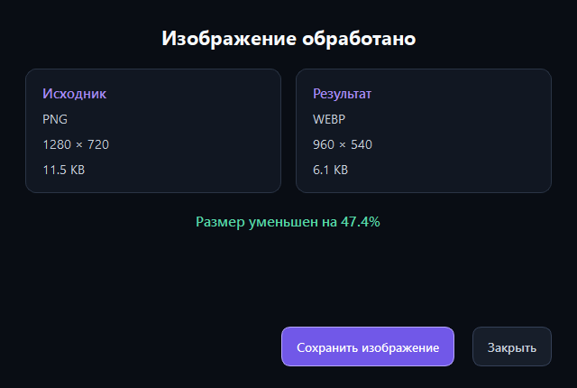
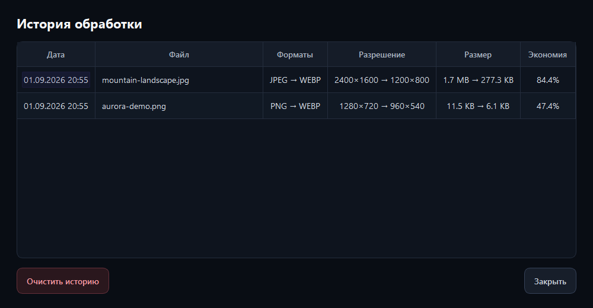

# Pixora

Pixora — нативное desktop-приложение на Python и PySide6 для локальной
обработки изображений. Приложение изменяет размер и формат, настраивает
качество, поворачивает и отражает изображения, не передавая файлы во внешние
сервисы.



## Возможности

- загрузка через Drag & Drop или системный проводник;
- адаптивный предпросмотр и метаданные исходного файла;
- изменение ширины и высоты с автоматическим сохранением пропорций;
- конвертация между JPEG, PNG и WEBP;
- настройка качества JPEG и WEBP от 1 до 100;
- поворот на −90°, +90° или 180°;
- горизонтальное и вертикальное отражение;
- обработка в фоновом потоке без зависания интерфейса;
- сравнение исходника и результата перед сохранением;
- локальная история SQLite с повторным открытием сохранённых файлов;
- тёмная тема, состояния загрузки и toast-уведомления.

| Результат обработки | История операций |
| --- | --- |
|  |  |

## Требования

- Python 3.12 или новее;
- Windows, Linux или macOS с поддержкой PySide6;
- около 500 МБ для виртуального окружения.

Для исходных файлов поддерживаются расширения `.jpg`, `.jpeg`, `.png` и
`.webp`. Максимальный размер файла — 20 МБ. Pixora также проверяет целостность
изображения и блокирует небезопасно большие размеры результата.

## Установка и запуск

```powershell
git clone https://github.com/7sy-png/Pixora.git
cd Pixora
python -m venv .venv
.\.venv\Scripts\Activate.ps1
python -m pip install --upgrade pip
python -m pip install -r requirements.txt
python main.py
```

В Linux и macOS активируйте окружение командой
`source .venv/bin/activate`. База истории создаётся автоматически в
`data/pixora.db` при первом запуске.

## Как пользоваться

1. Перетащите изображение в окно или нажмите «Выбрать изображение».
2. Укажите размер, формат, качество, поворот и отражение.
3. Нажмите «Обработать изображение».
4. Сравните параметры исходника и результата.
5. Сохраните файл в выбранную папку.
6. Откройте «Историю», чтобы посмотреть операции или открыть сохранённый
   результат двойным щелчком.

## Тесты

Основная логика покрыта 60 автоматическими тестами: процессоры, pipeline,
валидация, модели, SQLite, Repository, HistoryService и фоновый worker.

```powershell
python -m pytest -q -W error
```

Скриншоты документации можно воспроизвести командой:

```powershell
python scripts/capture_screenshots.py
```

## Docker

GUI запускается нативно, а Docker используется как изолированное окружение
для автоматических тестов.

```powershell
docker build -t pixora-tests .
docker run --rm pixora-tests
```

Контейнер использует `python:3.12-slim`, offscreen-режим Qt и запускает pytest
с преобразованием предупреждений в ошибки.

## Архитектура

```text
PySide6 UI
    │ signals / slots
    ▼
ImageWorker (QThreadPool)
    │
    ▼
ImageService ──► ProcessorFactory ──► Strategy-процессоры Pillow

HistoryService ──► HistoryRepository ──► SQLite
```

Pipeline обработки имеет фиксированный порядок:
`resize → rotate → flip → convert → compress`. UI не выполняет операции
Pillow напрямую, а готовый результат кодируется в памяти один раз и теми же
байтами сохраняется на диск.

### Использованные паттерны

| Паттерн | Реализация | Назначение |
| --- | --- | --- |
| Strategy | `ImageProcessor` и отдельные процессоры | Изолирует каждую операцию над изображением |
| Factory | `ProcessorFactory` | Создаёт стратегию по стабильному имени операции |
| Repository | `HistoryRepository` | Скрывает SQL и преобразование строк SQLite |
| Observer | сигналы и слоты Qt | Связывает UI, worker и уведомления без жёстких зависимостей |

## Структура проекта

```text
app/
  database/      настройка SQLite и схема истории
  models/        неизменяемые модели данных и параметры обработки
  processors/    стратегии Pillow и фабрика обработчиков
  repositories/  доступ к истории операций
  resources/     QSS-тема и SVG-иконки
  services/      pipeline обработки и сценарии истории
  ui/            окна и виджеты PySide6
  utils/         валидация и форматирование данных
  workers/       фоновые задачи Qt
docs/screenshots/ скриншоты интерфейса
reports/          план и отчёт разработки
scripts/          служебные сценарии проекта
tests/            unit- и integration-тесты
Dockerfile        окружение запуска тестов
main.py           точка входа приложения
```

## Данные и приватность

Изображения обрабатываются только локально. История содержит пути и метаданные
файлов и хранится в локальной базе `data/pixora.db`. Удалить все записи можно
кнопкой «Очистить историю» с подтверждением.

## Лицензия

Проект распространяется по [лицензии MIT](LICENSE).
